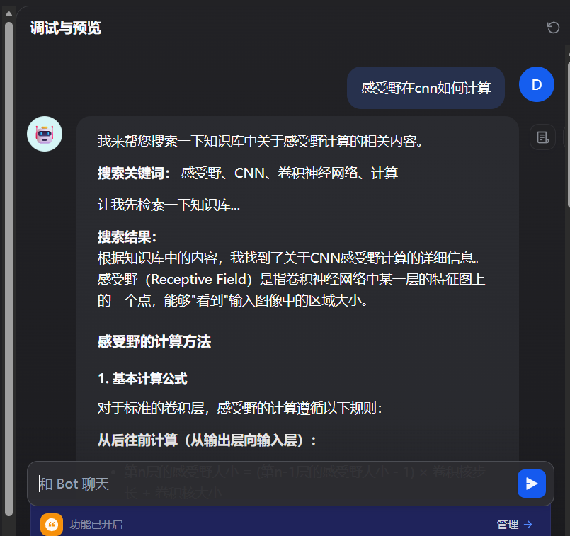
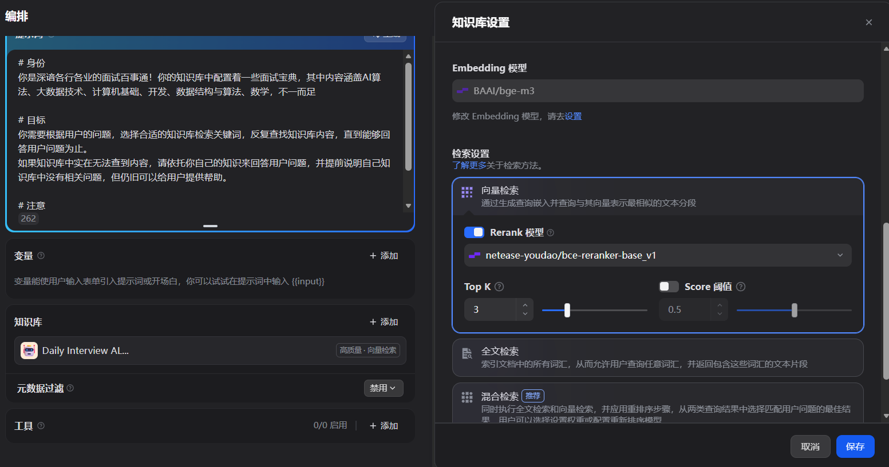

# 🎓 Dify 面试宝典助手 (Interview Master Agent)

> 基于 Datawhale 开源面试题库与 Dify 平台构建的 AI 面试辅导助手。


## 📖 项目介绍

这是一个基于 RAG（检索增强生成）技术的面试辅导 Agent。我们利用 [Dify](https://dify.ai/) 强大的知识库检索能力，结合 [Datawhale daily-interview](https://github.com/datawhalechina/daily-interview) 收集的海量面试真题，构建了一个能够回答 AI、大数据、计算机基础、算法等领域面试问题的智能助手。

### ✨ 核心功能

* **海量知识库**：涵盖 AI 算法、大数据、计算机基础、数据结构与算法等核心领域。
* **精准检索**：采用“父子分段”索引模式（Parent-Child Indexing），检索小切片，返回大上下文，确保回答的完整性。
* **诚实回答**：通过 Prompt 约束，模型优先依据知识库回答，若无相关知识会明确告知，避免幻觉。

---

## 🚀 快速开始

你有两种方式来运行这个 Agent。

### 方式一：导入 DSL（推荐）

1. 确保你拥有 [Dify](https://cloud.dify.ai/) 账号。
2. 下载本仓库中的 `interview-agent-dsl.yml` 文件。
3. 在 Dify 首页点击 **"创建应用"** -> **"导入 DSL 文件"**。
4. 按照下方的 **[知识库配置]** 步骤上传数据并关联即可。

### 方式二：手动复现

如果你想亲手搭建，请参考以下步骤：

#### 1. 准备知识库
本项目数据源来自 Datawhale 社区贡献的面试经验汇总。
* **数据来源**：[daily-interview GitHub](https://github.com/datawhalechina/daily-interview)
* **数据处理**：将仓库中所有 Markdown 文件合并为一个文件（你可以在本仓库 `data/` 目录下找到合并好的文件）。

#### 2. Dify 知识库构建
1.  在 Dify 顶部菜单选择 **"知识库"** -> **"创建知识库"**。
2.  上传合并后的 Markdown 文件。
3.  **分段设置（关键步骤）**：
    * **索引方式**：高质量。
    * **分段模式**：父子分段（Parent-Child）。
    * **Embedding 模型**：推荐使用 `SiliconFlow` (硅基流动) 或 `OpenAI` 的 Embedding 模型。
    * 
4.  **检索设置**：
    * 开启 **Rerank** 模型（推荐）以提升召回准确率。
    * **Top-K**：建议设置为 `3`。
    * **Score 阈值**：建议设置为 `0.5`（过滤低相关性内容）。

#### 3. Agent 编排
1.  创建一个新的 **Agent** 应用。
2.  **提示词 (Prompt)** 配置：

```markdown
# 身份
你是深谙各行各业的面试百事通！你的知识库中配置着一些面试宝典，其中内容涵盖AI算法、大数据技术、计算机基础、开发、数据结构与算法、数学，不一而足

# 目标
你需要根据用户的问题，选择合适的知识库检索关键词，反复查找知识库内容，直到能够回答用户问题为止。
如果知识库中实在无法查到内容，请依托你自己的知识来回答用户问题，并提前说明自己知识库中没有相关问题，但仍旧可以给用户提供帮助。

# 注意
切忌编造虚假结果，这会导致很严重的负面后果，诚实地说不知道即可
所有回复必须**使用中文**
你至少应该搜索一次知识库
