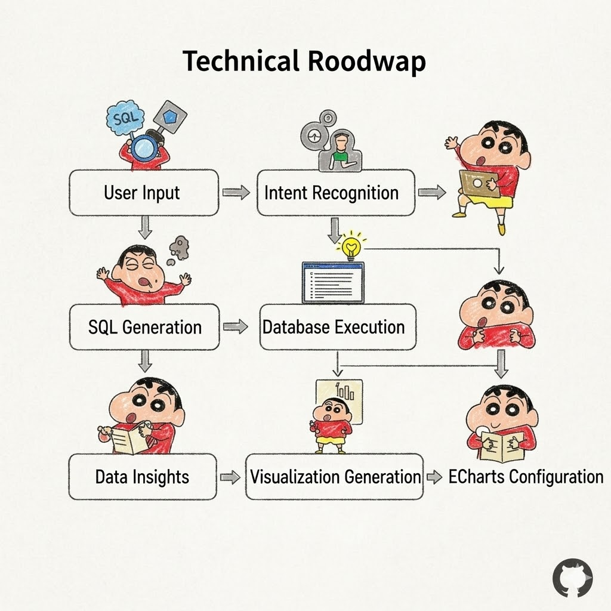
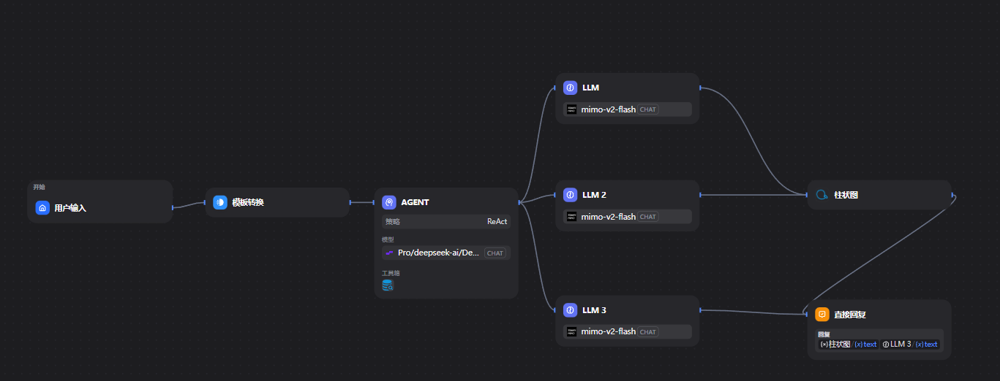
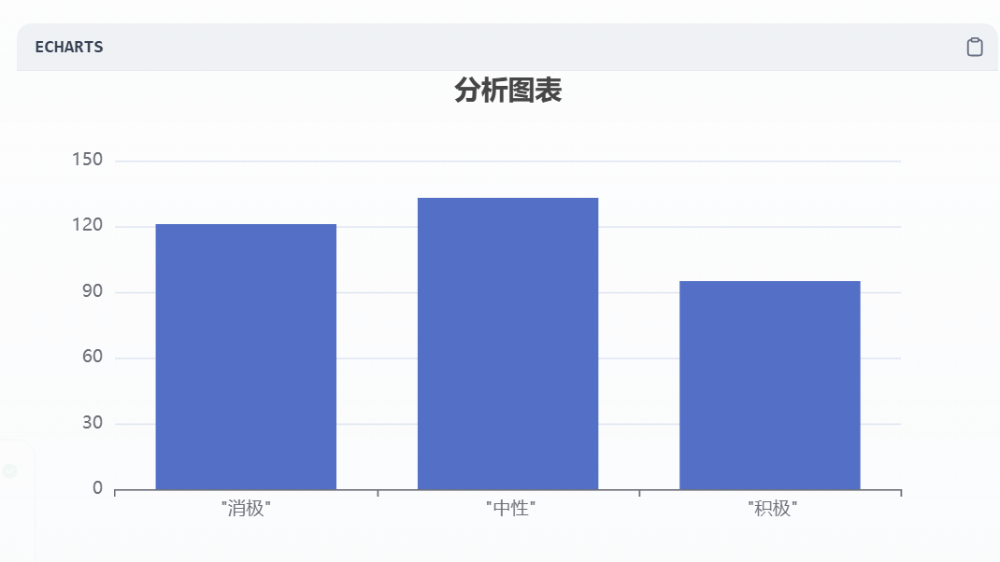

# 3️⃣ 📊SQL智能分析可视化助手 (NL2SQL + ECharts)
基于 Dify 实现「自然语言转 SQL + ECharts 数据分析可视化」的实战项目，适配 SQL Server 环境，聚焦评论情感/关键词分析场景，提供可直接复用的 SQL 脚本、Dify 配置、ECharts 可视化代码。

[](https://learn.microsoft.com/zh-cn/sql/sql-server/)
[](https://dify.ai/)
[](https://echarts.apache.org/)


## ✨ 核心功能

| 功能模块 | 说明 | 技术亮点 |
|---------|------|---------|
| 📝 自然语言转 SQL | 用户用中文描述需求，AI 生成标准 SQL | 多轮澄清机制，处理模糊需求 |
| 🔍 SQL 智能纠错 | 自动检测语法错误，给出修复建议 | 对接数据库元数据，精准定位 |
| 📊 ECharts 可视化 | 根据查询结果自动生成图表配置 | 智能图表类型推荐（柱状/折线/饼图等） |
| 💡 数据洞察 | 自动分析数据趋势，生成文字解读 | 结合业务场景的智能摘要 |

## 📋 目录结构

---

## 🛠️ 技术实现

### 1. 工作流节点设计

| 节点 | 类型 | 功能说明 |
|------|------|---------|
| `意图分类` | 条件节点 | 区分"生成SQL" / "优化SQL" / "解释SQL" |
| `Schema检索` | 知识库检索 | 匹配表结构、字段含义、示例SQL |
| `SQL生成` | LLM节点 | 生成可执行SQL，带注释说明 |
| `SQL校验` | 代码节点 | 语法检查 + 权限验证 |
| `执行查询` | 代码节点 | 连接数据库，返回结果集 |
| `图表推荐` | LLM节点 | 根据数据特征推荐图表类型 |
| `ECharts配置` | 代码节点 | 生成标准 ECharts option JSON |


---
### 2. 关键提示词片段

**Agent-SQL生成提示词：**
```python
# 角色
你是资深数据分析师，精通 {数据库类型} SQL 优化。

# 上下文
表结构信息：{{#context#}}
用户历史查询：{{#history#}}

# 任务
将用户请求转化为标准 SQL：
- 用户请求：{{#query#}}
- 输出要求：仅返回 SQL 代码 + 中文注释，不要解释

# 约束
- 禁止使用 SELECT *
- 必须添加 LIMIT 1000
- 时间字段需处理时区
```
**Agent-echart生成提示词：**
```python
# 角色
你是ECharts可视化专家，擅长根据数据特征推荐最优图表类型。

# 上下文
数据特征：{{#data_features#}}
- 数据类型：{{#data_type#}}（分类数据/时序数据/占比数据）
- 维度字段：{{#dim_field#}}
- 数值字段：{{#num_field#}}
- 数据量：{{#data_count#}}

# 任务
1. 推荐图表类型（单选）：柱状图/折线图/饼图/标签云
2. 生成ECharts option JSON配置，要求：
   - 适配GitHub浅色/深色模式
   - 标题包含业务场景（如「积极评论关键词频次」）
   - 坐标轴/图例命名清晰，支持中文
   - 配色方案：主色#2eaadc，辅助色#34d399

# 约束
- JSON配置可直接嵌入HTML，无需额外处理
- 适配PC端展示，宽度100%，高度400px
```
##  📝效果展示
### 📊 评论数据分析报告

根据提供的数据和表结构，我将对评论情绪分布进行分析并创建可视化图表。

---

### 🎭 情绪分布分析

从 SQL 查询结果来看，评论情绪分布如下：

| 情绪类型 | 数量 | 占比 |
|---------|------|------|
| 🔴 消极评论 | 121 条 | ~35% |
| 🟡 中性评论 | 133 条 | ~38% |
| 🟢 积极评论 | 95 条 | ~27% |

---

### 📈 可视化图表

使用柱状图展示情绪分布情况：

```python
import matplotlib.pyplot as plt
import seaborn as sns

# 数据准备
data = {
    "xdata": ["消极", "中性", "积极"],
    "ydata": [121, 133, 95]
}

# 创建图表
plt.figure(figsize=(10, 6))
sns.barplot(x=data["xdata"], y=data["ydata"], palette=["#ff6b6b", "#feca57", "#1dd1a1"])

# 添加标题和标签
plt.title("评论情绪分布分析", fontsize=16, pad=20)
plt.xlabel("情绪类型", fontsize=12)
plt.ylabel("评论数量", fontsize=12)

# 添加数据标签
for i, v in enumerate(data["ydata"]):
    plt.text(i, v + 2, str(v), ha='center', fontsize=12)

# 美化图表
sns.despine()
plt.tight_layout()
plt.show()
```


## ⚠️ 注意事项
1. **数据库兼容**：
   - SQL Server 需启用 TCP/IP 并放行1433端口（公网访问需配置安全组）；
   - MySQL 需开启远程访问，配置 `bind-address = 0.0.0.0`；
   - Oracle/Oracle11g 需配置监听器，开放1521端口；
   - PostgreSQL 需修改 `pg_hba.conf` 允许远程连接，开放5432端口；
2. **提示词优化**：根据实际表结构更新「Schema检索」知识库，提升SQL生成准确率；
3. **安全规范**：
   - 数据库账号仅授予只读权限（如 SQL Server 的db_datareader、MySQL的SELECT权限），禁止授超管权限；
   - 公网部署时，限制Dify服务器的IP访问范围；
4. **性能优化**：大数据量查询时，在SQL生成阶段添加分区/索引提示。

## 📚 参考资料
1. 飞书实操教程：[text2sql + ECharts 数据分析全流程](https://my.feishu.cn/wiki/ZnHOwThLPi0D0CkNp1VcpTHinhe)
2. Dify 官方文档：[工作流设计指南](https://docs.dify.ai/zh-hans/guides/workflow)
3. ECharts 官方文档：[配置项手册](https://echarts.apache.org/zh/option.html)
4. SQL 语法兼容：[各数据库聚合函数对比](https://learn.microsoft.com/zh-cn/sql/t-sql/functions/string-agg-transact-sql?view=sql-server-ver16)

## 📬 问题反馈
若遇到 SQL 生成错误、图表渲染异常、数据库连接失败等问题，可参考飞书教程的「常见问题」章节，或提交 Issue 反馈
