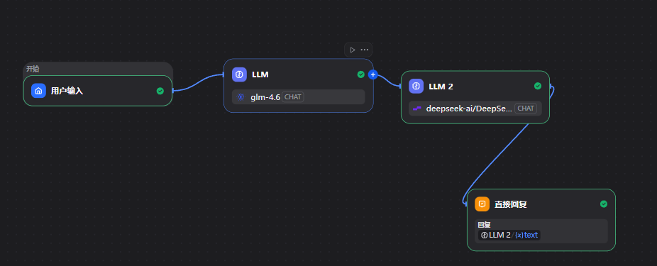

# 📚 基于 Dify Chatflow 的书籍卡片生成器

这是一个利用 Dify 编排的智能工作流。它能够通过联网搜索实时抓取书籍信息，并利用大模型生成精美的HTML响应式卡片。

## 🌟 项目亮点

- **双 LLM 协同架构**：
  - **LLM 1 (Search Engine)**: 负责联网搜索，精准抓取书名、作者、简介、封面图及评分。
  - **LLM 2 (Visual Designer)**: 接收结构化数据，实时构建符合审美、可交互的 HTML 代码。
  
- **实时渲染**：配合 Dify Artifacts 功能，实现书籍卡片的一键生成与即时预览。
- **自动化流**：无需手动查资料，只需输入一个书名。

## ⚙️ 工作流逻辑 (Chatflow)

1. **输入节点**: 用户输入想要搜索的书籍名称。
2. **搜索节点**: 第一个 LLM 调用搜索工具（如 Google/Bing）定位书籍元数据。
3. **转换节点**: 整理搜索结果为 JSON 结构。
4. **生成节点**: 第二个 LLM 填充 HTML/Tailwind CSS 模板。
5. **输出预览**: 通过 Artifacts 渲染最终视觉卡片。

## 🚀 如何使用

1. 在 Dify 中导入本项目提供的 DSL 文件。
   - **工作流文件**: [点击下载 小红书读书卡片.yml](./小红书读书卡片.yml)
3. 配置你的搜索工具 API 密钥（如 Serper 或 Google Search）。
4. 在对话框输入书名，点击运行。

## ⚠️ 常见问题排查

如果你在预览 **Artifacts** 时看到 `ERR_BLOCKED_BY_CLIENT` 错误：
- 请关闭浏览器的广告拦截插件（如 AdBlock 或 uBlock Origin）。
- 尝试在无痕模式（Incognito Window）下打开。
